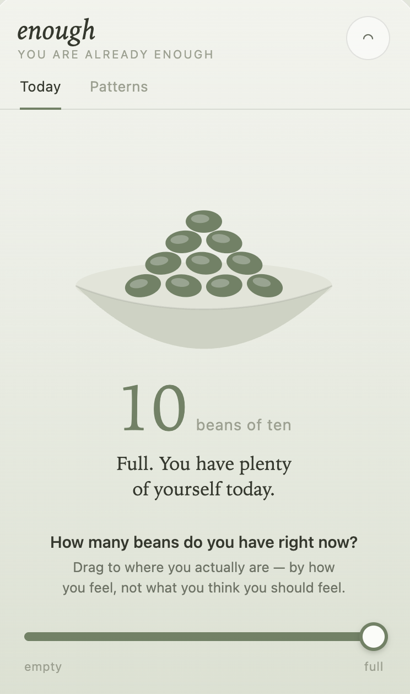

# Enough

> A calm, glanceable way to notice your daily capacity — one bean at a time.

<p align="center">
  
</p>

Enough is a small, private web app for noticing your daily energy — made for
people who tend to run themselves empty caring for everyone else.

You have about ten beans a day. Everyday stressors spend them; self-care fills
them back up. When you can see your beans, you can tend to yourself *before* you
run out — the way you tend to everyone else. It's a gentle cousin of "spoon
theory," made countable.

> **Status:** a personal, local-first project — it runs on your own device, with
> no hosted version and no account.

## Features

- **Daily check-in** — set how many beans (0–10) you have right now.
- **Patterns** — a gentle look back at how your days have gone.
- **Journal** — note what's shifting your beans today, in your own words.
- **Soft chimes** — optional gentle sounds and a bell for a pause.
- **Lock-screen glance** — see your beans at a glance.
- **Works offline** — your data never leaves your device.

## Requirements

- A modern web browser (Chrome, Edge, Safari, or Firefox).
- **Python 3** — used only to run Enough locally. macOS provides it (you may be
  prompted to install the Xcode Command Line Tools the first time you run it); on
  Windows or Linux, install it from [python.org](https://python.org).

## Install & run

1. **Get the files.** Either:
   - **Download the ZIP:** on the [repository page](https://github.com/fawndamitio/enough),
     click the green **Code** button → **Download ZIP**, then unzip it.
   - **Or clone it** *(in Terminal)*:
     ```
     git clone https://github.com/fawndamitio/enough.git
     ```
2. **Go into the folder** *(in Terminal)* — it's named `enough` if you cloned it,
   or `enough-main` if you downloaded the ZIP:
   ```
   cd enough
   ```
3. **Start the local server** *(in Terminal)*:
   ```
   python3 server.py
   ```
   The server takes over this window and keeps running — that's expected. Leave
   it open while you use the app.
4. **Open the app** *(in your browser)*: go to **http://localhost:8000**.

To stop the server, return to the Terminal window and press **Control + C**.

**Troubleshooting:** if you see `Address already in use`, something else is
already using port 8000 — close it (or the other server) and try again.

### Install it as an app (optional)

Because Enough is a Progressive Web App, you can install it for a full-screen,
offline experience:

- **Chrome / Edge:** click the install icon in the address bar (or menu → "Install Enough").
- **iPhone / iPad (Safari):** tap Share → "Add to Home Screen."

## Privacy

Everything you write stays on your device. No account, no server, nothing
collected — ever. Enough is just for you.

## Limitations

- **Your data lives on a single device.** Because everything is stored locally in
  your browser, it doesn't sync — using Enough on your phone and your laptop keeps
  two separate histories. That's the trade-off for staying private and
  account-free.
